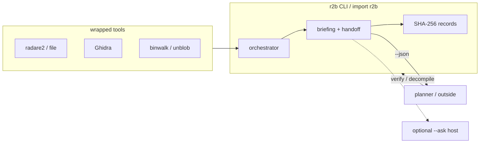

# Agents & Roles

Type **`r2b`**. Module paths below are `import r2b` (the library the
CLI loads). External agents (omp, Claude Code, Grok) shell out to the
CLI. Do not absorb a planner here.

| Layer | Name |
|---|---|
| Command | `r2b` (`r2b` alias) |
| Library | `src/r2b/`, extras `r2b[r2]` |
| JSON | `r2b.briefing.v1`, `r2b.handoff.v1` |
| Wrapped | radare2, file, Ghidra, binwalk/unblob — not this process |
| Optional `--ask` | overlay host (Ollama default) |

> User-facing setup: [README.md](README.md). Flavors:
> [docs/install.md](docs/install.md). Planner argv:
> [docs/HARNESS.md](docs/HARNESS.md). `--quick` vs deep, overlays:
> [docs/USAGE.md](docs/USAGE.md).
>
> Surface anomalies, sink callers, and next commands — not tutorials.
> Keep `brief` / `verify` / `decompile` / `records` /
> `insights` / `env` / `setup` stable. `--json` is stdout-only and
> includes `handoff`; empty `--ask` exits 2. Tested on aarch64 ELF and
> some firmware samples.
>
> **Install:** `./scripts/install.sh` sniffs RAM/arch (`core` / `lab` /
> `full`). Do not `uv sync --extra analyzers` on a Pi. Add a flavor by
> dropping `config/flavors/<name>.toml` and a branch in
> `r2b.environment.setup`.
>
> **`--ask` keys:** never in committed toml. Copy an overlay to
> `config/local.toml`; put the key in `.env`. Default is local Ollama
> (no extra, no key). Hosted: OpenRouter, OpenAI, xAI, Z.ai/GLM,
> Anthropic, or `base_url` for vLLM/llama.cpp/exo. Analysis never
> calls a model. Do not turn `brief` into a planner. Hosted SDKs are
> extra `llm`; Flask is extra `web`.

`r2b review BRIEFING --mode rules|llm|both` creates a separate,
non-mutating `r2b.review.v1` artifact. `compare` aliases `both`. Rules mode
makes no model call. Model modes may only permute known region/evidence IDs;
v1 executes no tools and never rewrites briefing scores or handoff argv.

## Analyzer Orchestrator (Python)
- **Entry point**: `r2b.analysis.orchestrator.AnalysisOrchestrator`
- **Inputs**: file path, analysis plan, environment report, trajectory DAO
- **Responsibilities**:
  - classify the subject (ELF vs container) before dispatching adapter work
  - assemble adapter registry (`libmagic`, `radare2`, `capstone`, optional `ghidra`/`firmware`/`angr`)
  - execute quick/deep stages, fan out container children when present, record outputs + issues, and attach results to chat sessions
  - maintain OFRAK-style resource tree for downstream use
  - log every action to the trajectory store (`TrajectoryDAO`)
- **Outputs**: `AnalysisResult` bundle (resource tree, quick/deep payloads, notes, issues)

## Adapter Agents
Each adapter provides a uniform interface (`AnalyzerAdapter` protocol) and can be swapped / extended.

| Adapter | Module | Capability | Notes |
|---------|--------|------------|-------|
| Libmagic | `r2b.adapters.libmagic` | file identification | minimal dependencies, sanity check |
| Firmware | `r2b.adapters.firmware` | firmware inventory, signatures, bounded carving, fanout recommendations | handles generic firmware blobs and embedded files before ELF-only tools run |
| Radare2 | `r2b.adapters.radare2` | metadata, CFG, functions, `verify_scan` | `r2b verify` / `brief --verify` resolve first-arg at dangerous imports |
| Capstone | `r2b.adapters.capstone` | first-chunk disassembly | derives architecture from radare2 quick scan |
| Ghidra | `r2b.adapters.ghidra` | decompilation, types, one-function decompile | `r2b decompile BIN ADDR`; whole-binary dumps are not the default |
| angr | `r2b.adapters.angr` | symbolic execution | extra `symbolic`; off in core/lab |
| DWARF | `r2b.adapters.dwarf` | debug symbol parsing | extracts source-level type info from binaries |
| Frida | `r2b.adapters.frida` | dynamic instrumentation | runtime memory/module inspection |
| GEF | `r2b.adapters.gef` | execution tracing | Docker-isolated GDB with register snapshots |

Adapters raise `AdapterUnavailable` when prerequisites are missing to keep the orchestrator composable.

Keep the loop `brief` (dispatch) → `verify` / `decompile` (confirm) → record store.
Empty `--ask` bodies retry once then fail loudly. Insights drop ubiquitous libc
imports and surface identical-SHA ELFs so C7/A7-style duplicates are not two findings.

### Ghidra Integration Details
The Ghidra adapter supports two modes:

1. **Headless Mode** (default): Runs `analyzeHeadless` subprocess with `R2BHeadless.java` script that outputs JSON containing functions, strings, and decompiled code. Auto-copies script to `~/ghidra_scripts/`.

2. **Bridge Mode** (richer data): Connects to running Ghidra GUI via `ghidra_bridge` RPC. Provides real-time access to decompilation, types, and cross-references.

> ⚠️ **Note**: PyGhidra 3.0.2 has a recursion bug with Python 3.11 in `_GhidraBundleFinder.find_spec()`. Headless mode is a subprocess r2b wraps; it is not in-process PyGhidra.

## Environment Sentinel
- **Module**: `r2b.environment.detectors`
- **Purpose**: gather telemetry about installed tools before running expensive stages.
- **Outputs**: `EnvironmentReport` consumed by CLI + orchestrator, plus dedicated Ghidra detection payloads.
- **Ghidra Setup**: `r2b ghidra setup --version <version>`, `--url <archive>`, or `--archive <zip>` installs a local Ghidra distribution under the tools directory and prints `GHIDRA_INSTALL_DIR`.
- **Extensibility**: `_COMMANDS` now includes optional `qemu`/`frida` probes and the detector inspects local/remote LLM availability.

## Trajectory Recorder
- **Storage**: SQLite via `r2b.storage.Database` and `TrajectoryDAO`
- **Schema**: `trajectories` table + `trajectory_actions` child rows (JSON payload)
- **Usage**:
  - `AnalysisOrchestrator` calls `append_action` after each stage.
  - Replay scripts can iterate actions to reproduce or diff analyses on new binaries.

## Chat Companion (SQLite)
- **Module**: `r2b.storage.chat` (`ChatDAO`)
- **Purpose**: persist chat sessions keyed by binary/trajectory, attach structured analysis snapshots, and archive LLM answers.
- **Workflow**:
  - Sessions are created/upserted when an analysis job starts.
  - System message with the serialized `AnalysisResult` is appended on completion (attachments tagged `analysis_result`).
  - Web UI/API append user prompts and LLM responses (provider from overlay).
- **Downstream**: transcripts power replay, progress reports, and LLM context rebuilding.

## Firmware Triage Agent
- **Backend Module**: `r2b.adapters.firmware`
- **Frontend Module**: `web/frontend/src/components/FirmwareTriagePanel.tsx`
- **Capabilities**:
  - identify common firmware/container signatures in generic binary blobs
  - carve bounded embedded artifacts for follow-on analysis
  - summarize entropy, strings, candidate filesystems, and tool gaps
  - recommend analyzer fanout targets for `radare2`, `ghidra`, and `angr`
- **Limits**: uploads are capped at 200MB and firmware extraction is deliberately bounded to keep the dashboard responsive.

## Graph Explorer Agent
- **Frontend Module**: `web/frontend/src/components/GraphExplorer.tsx`
- **Backend Sources**: `r2b.analysis.graph`, `r2b.analysis.investigation_graph`, `/api/chats/<session_id>/graphs`
- **Purpose**: explore subject-under-test findings and investigation journey data together as a segmented map.
- **Views**:
  - overview map groups subject, artifacts, code, indicators, tools, and issues
  - segment map compacts noisy node types into aggregate nodes and keeps context links
  - full graph remains available for raw inspection
- **Evidence semantics**: imports, strings, signatures, and function-name matches are pivots, not behavior or confirmed findings. Static behavior needs a caller/xref and data flow; observed behavior needs runtime evidence. Model interpretations stay proposed.

## Reporting Agent
- **Backend Endpoint**: `GET /api/chats/<session_id>/bundle`
- **Schema**: `schemas/analysis_bundle.schema.json`
- **Docs**: `docs/REPORTING.md`
- **Purpose**: export replayable JSON and Markdown reports containing subject metadata, findings, tooling, graphs, journey actions, and optional raw evidence.
- **Release Artifact**: tag `vX.Y.Z` matching `pyproject.toml`. Workflow
  `.github/workflows/release.yml` runs tests, `uv build`, frontend tarball,
  schema contract, checksums, provenance, and `gh release create`. See
  [docs/RELEASE.md](docs/RELEASE.md).

## LLM Companion
- **Module**: `r2b.llm.manager.LLMBridge`
- **Role**: optional `--ask` / Chat. Overlay in `config/local.toml` picks
  the host. Default is local Ollama. Copy `config/*.example.toml` for
  OpenRouter, OpenAI, xAI, Z.ai/GLM, Anthropic, or set `base_url`
  for a local server (vLLM, llama.cpp, exo). Analysis does not call this.
- **Context Management**:
  - Full analysis context (binary info, disassembly, functions) is included in every LLM message
  - Last 15 conversation exchanges are maintained for continuity
  - Web Thesis / `user_goal` is chat context only; it does not rerank regions
- **Invocation**: optional CLI `--ask`, web chat (`POST /api/chats/<id>/messages`). Analysis never calls a model.
- **ARM Specialization**: When ARM binaries are detected, prompts emphasize ARM instruction explanation and reference official docs.
- **Extensibility**: add providers by implementing `chat/summarize_analysis` (see `openai_client.py`, `claude_client.py`) and wiring via config.

## Annotation Agent
- **Storage**: SQLite via `annotations` table, synced with chat sessions
- **Frontend**: `DisassemblyViewer` component with drag-select and inline annotation popover
- **API Endpoints**:
  - `GET /api/chats/<session_id>/annotations` - list annotations
  - `POST /api/chats/<session_id>/annotations` - create/update annotation
  - `DELETE /api/chats/<session_id>/annotations/<address>` - delete annotation
- **Persistence**: Annotations are saved to both localStorage (client backup) and SQLite (portable/sync)
- **Integration**: Selected code + annotations can be sent directly to Claude for explanation

## CFG Viewer Agent
- **Module**: `web/frontend/src/components/CFGViewer.tsx`
- **Data Sources**: 
  - angr CFG nodes/edges (symbolic execution)
  - radare2 function CFGs with block-level disassembly
- **Debug Features**: When CFG data is missing, displays diagnostic checklist:
  - angr installation status
  - Analysis mode (full vs quick)
  - Binary validity
  - Node/edge/function counts
- **Navigation**: OFRAK-style function list → block navigation → inline disassembly

## ARM Compiler Agent
- **Backend Module**: `r2b.compilation.compiler`
- **Frontend Module**: `web/frontend/src/components/CompilerPanel.tsx`
- **Capabilities**:
  - Cross-compile C to ARM32/ARM64 via Docker container
  - Auto-detect freestanding (`_start`) vs libc-linked (`main`) code
  - Generate both ELF binary and assembly source
  - Godbolt-style assembly viewer with syntax highlighting
- **Docker Image**: `r2b-compiler:latest` (built from `Dockerfile.compiler`)
- **Compiler Flags**:
  - Freestanding: `-ffreestanding -nostartfiles -nodefaultlibs -static`
  - Libc (musl): `-static -specs=/musl/<arch>.specs`
- **Example Templates**: Hello World, Fibonacci, Loops, Memory operations
- **Download Artifacts**: Binary and `.s` assembly files downloadable from UI

## ARM Instruction Documentation
- **Reference**: [ARM Developer DUI0489](https://developer.arm.com/documentation/dui0489/h/arm-and-thumb-instructions/instruction-summary)
- **Implementation**: `DisassemblyViewer` provides hover tooltips for ARM32/64 and x86 instructions
- **Coverage**: 100+ instructions with descriptions (MOV, LDR, BL, PUSH, etc.)
- **Fallback**: Search link to ARM Developer site for unknown instructions

## Session Manager
- **Frontend Module**: `web/frontend/src/components/SessionList.tsx` + `App.tsx`
- **Backend**: `r2b.storage.chat.ChatDAO`
- **Features**:
  - Create new sessions via "+" button in sidebar
  - Switch between active sessions (each linked to a binary)
  - Delete sessions when no longer needed
  - Auto-sync annotations and chat history across sessions
- **Persistence**: All sessions stored in SQLite with full message history

## Next session

Do not re-run archived plans. Type `r2b`. `import r2b` is the library.

- Web Thesis is a note for `--ask` / chat. Briefing ranking stays the CLI point
  table; explicit `review` can compare that immutable order with a model order.
- `POST /api/analyze` inherits adapter defaults from config. Exhaustive enables angr/Ghidra unless explicitly overridden, but Frida/GEF native execution remains explicit.
- Hidden `pilot` still execs `r2b` / `analyze`. Keep hidden; if touched, `r2b` + `brief`.
- Do not revive `brief --goal`.
- Later: PyPI `r2brief`, XDG `~/.cache/r2b` / `~/.config/r2b`.
- Compile is the web panel, not a CLI verb.
- Archive: `docs/archive/r2b-cli-rename.md` (done). `docs/plans/2026-01-27-unified-tool-execution.md` is superseded (do not absorb a planner).
