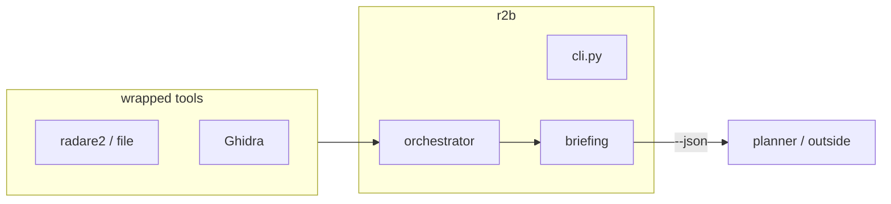

# CLAUDE.md - Development Guide

Agent/dev notes. **Setup and interfaces: [README.md](README.md).**
Roles: [AGENTS.md](AGENTS.md).

Type **`r2b`**. `import r2b` is the library (`src/r2b/`). Product
name: r2brief. Not a teaching UI. omp (Oh My Pi) is a separate harness
that *calls* this CLI — do not absorb that planner here.

| Layer | Name |
|---|---|
| Command | `r2b`, `r2b-web` (`r2b` / `r2b-web` aliases) |
| Library | `src/r2b/` |
| JSON | `r2b.briefing.v1` |
| Wrapped | radare2, file, Ghidra, binwalk/unblob |
| Optional `--ask` | overlay host (Ollama default) |



## Quick Commands

```bash
# Setup
./scripts/install.sh            # sniff + recommended uv extra (usually r2)
uv run r2b setup --json
uv run r2b env

# Development (checkout: brief + web + hosted --ask SDKs)
uv sync
uv run r2b-web                     # Start Flask backend on :5050
cd web/frontend && npm run dev      # Start Vite frontend on :5173

# Testing
uv run pytest                       # Run Python unit tests
uv run pytest tests/unit/           # Run only unit tests
uv run pytest tests/integration/    # Run integration tests
cd web/frontend && npm test         # Run frontend tests

# Linting & Type Checking
uv run ruff check src/              # Lint Python code
uv run ty check src/                # Type check Python code
cd web/frontend && npm run lint     # Lint frontend code

# CLI Usage
uv run r2b brief samples/bin/arm64/hello --quick --json
uv run r2b env --json

# Compilation is the web compiler panel, not a CLI verb.

# Optional: Build GEF Docker image for dynamic analysis
docker build -t r2b-gef -f Dockerfile.gef .

# Optional: Test Ghidra bridge connectivity
python scripts/test_ghidra_bridge.py
```

## Architecture

### Backend (Python 3.11+, uv-managed)

`r2b` is `[project.scripts] r2b = r2b.cli:run`. Tree is the library:

```
src/r2b/
├── cli.py                 # Typer CLI entry point
├── config.py              # Pydantic configuration management
├── state.py               # Application state container
├── adapters/              # Analysis tool adapters
│   ├── base.py            # AdapterRegistry and base classes
│   ├── autoprofile.py     # Quick profiling (file, strings, checksec, binwalk)
│   ├── radare2.py         # Primary disassembly (r2pipe)
│   ├── angr.py            # Symbolic execution & CFG
│   ├── capstone.py        # Instruction-level disassembly
│   ├── libmagic.py        # File type identification
│   ├── ghidra.py          # Headless decompilation + bridge mode
│   ├── ghidra_bridge_client.py  # RPC client for Ghidra bridge
│   ├── frida.py           # Dynamic instrumentation
│   └── gef.py             # GDB/GEF dynamic analysis (Docker)
├── analysis/
│   ├── orchestrator.py    # Multi-stage analysis pipeline
│   └── resource_tree.py   # OFRAK-inspired binary hierarchy
├── compilation/           # Assembly recompilation
│   └── compiler.py        # GCC/Clang wrapper for ARM
├── llm/                   # optional --ask (overlay host)
│   ├── manager.py         # LLMBridge
│   ├── claude_client.py   # Anthropic overlay
│   └── openai_client.py   # OpenRouter / OpenAI / xAI / GLM / vLLM overlays
├── storage/               # SQLite persistence
│   ├── db.py              # Database management
│   ├── models.py          # Domain models
│   ├── dao.py             # Trajectory DAO
│   └── chat.py            # Chat session DAO
└── web/
    ├── app.py             # Flask REST API
    └── server.py          # WSGI server
```

### Frontend (React 18 + TypeScript, Vite)

```
web/frontend/src/
├── App.tsx                # Main application shell with tabs: Results, Chat, Compiler, Logs
├── components/
│   ├── AutoProfilePanel.tsx   # Security profile, strings analysis, risk indicators
│   ├── CFGViewer.tsx          # Control flow graph with zoom, maximize, function naming
│   ├── CodeEditor.tsx         # C code editor + AsmViewer with syntax highlighting
│   ├── CompilerPanel.tsx      # ARM cross-compiler UI with examples
│   ├── DecompilerPanel.tsx    # Ghidra decompiled C code viewer with types
│   ├── DisassemblyViewer.tsx  # Annotatable disassembly with tooltips
│   ├── DWARFPanel.tsx         # Debug information viewer
│   ├── GEFPanel.tsx           # Dynamic analysis: registers, memory, execution trace
│   ├── ChatPanel.tsx          # AI conversation interface
│   ├── ProgressLog.tsx        # Real-time analysis events (SSE)
│   ├── ResultViewer.tsx       # Analysis results with tabbed view
│   ├── SessionList.tsx        # Session sidebar with new/delete
│   ├── SettingsDrawer.tsx     # Configuration UI
│   └── ToolAttribution.tsx    # Display of analysis tools used
├── types.ts               # TypeScript interfaces
└── theme.ts               # MUI theme configuration
```

## Key Patterns

### Adapter Pattern
Each analysis tool is wrapped in an adapter implementing:
- `is_available() -> bool` - Check if tool is installed
- `quick_scan(binary) -> dict` - Fast metadata extraction
- `deep_scan(binary) -> dict` - Full analysis

### Resource Tree (OFRAK-inspired)
Binaries are represented as hierarchical resources:
```
BinaryResource
├── FunctionResource (offset, size, blocks)
└── FunctionResource
    └── InstructionResource (address, bytes, mnemonic)
```

### Decompilation Uncertainty
When both radare2 and angr provide analysis, uncertainty is calculated:
- High confidence: Both tools agree on structure
- Medium confidence: Minor differences in block boundaries
- Low confidence: Significant structural disagreement

## Testing Strategy

### Unit Tests (`tests/unit/`)
- Test individual adapters with mocked binaries
- Test resource tree construction
- Test configuration loading
- Run with: `uv run pytest tests/unit/ -v`

### Integration Tests (`tests/integration/`)
- Test full analysis pipeline with real binaries
- Test web API endpoints
- Test compilation workflow
- Run with: `uv run pytest tests/integration/ -v`

### Frontend Tests
- Component tests with Vitest + React Testing Library
- Run with: `cd web/frontend && npm test`

## Adding New Features

### New Adapter
1. Create `src/r2b/adapters/new_tool.py`
2. Implement `is_available()`, `quick_scan()`, `deep_scan()`
3. Register in `AdapterRegistry` in orchestrator
4. Add tests in `tests/unit/test_adapters.py`

### New API Endpoint
1. Add route in `src/r2b/web/app.py`
2. Add TypeScript types in `web/frontend/src/types.ts`
3. Add frontend integration tests

### Key API Endpoints
- `POST /api/analyze` - Run analysis on a binary (supports `quick_only`, `enable_angr` flags)
- `POST /api/compile` - Compile C code to ARM binary (uses Docker cross-compiler)
- `GET /api/compile/download/<filename>` - Download compiled binary or assembly
- `POST /api/chats/<id>/messages` - Send a message to Claude about the binary
- `GET /api/chats/<id>/analysis` - Fetch just the latest analysis result for a session (lightweight; used to restore the Results/Map tabs without loading full chat history)
- `GET /api/chats/<id>/annotations` - List annotations for a session
- `GET /api/chats/<id>/function-names` - List custom function names for a session
- `POST /api/chats/<id>/function-names` - Upsert a function name (LLM or human)
- `POST /api/functions/suggest-names` - Batch LLM function naming for generic functions

### New UI Component
1. Create in `web/frontend/src/components/`
2. Add to appropriate parent component
3. Add component tests with Vitest

## Configuration

### Environment Variables
```bash
# --ask overlays: key in .env, never in toml. Default host is Ollama (none).
# OPENROUTER_API_KEY=...   # after cp config/openrouter.example.toml config/local.toml
# OPENAI_API_KEY=...
# XAI_API_KEY=...
# ZAI_API_KEY=... / GLM_API_KEY=...
# ANTHROPIC_API_KEY=...    # provider = "anthropic"
R2B_WEB_HOST=127.0.0.1                          # Flask host (library env name)
R2B_WEB_PORT=5050                               # Flask port
GHIDRA_INSTALL_DIR=/home/kali/ghidra_11.2_PUBLIC # wrapped Ghidra, for decompile
R2B_DEBUG=true                                  # Enable debug logging (default: true)
```

### Debug Logging

Debug logging is enabled by default to help track user activity and diagnose issues.

**Backend (Python)**
- Configured via `R2B_DEBUG` environment variable (default: `true`)
- Logs API requests/responses with timing
- Logs analysis, chat, and session events
- Colorized output in terminal

**Frontend (TypeScript)**
- Configured via `localStorage.r2b_debug` (default: `true`)
- Logs activity events (tab switches, function views, CFG interactions)
- Logs API calls and chat messages
- Console access: `window.r2bDebug`

**Console commands:**
```javascript
r2bDebug.enable()       // Enable debug logging
r2bDebug.disable()      // Disable debug logging
r2bDebug.exportLogs()   // Download logs as JSON
r2bDebug.clear()        // Clear log history
r2bDebug.getHistory()   // Get log entries array
```

### Analysis Settings (in config.toml)
```toml
[analysis]
enable_angr = false          # extra symbolic; off in core/lab
enable_ghidra = false        # Enable Ghidra decompilation
enable_frida = false         # Enable Frida dynamic instrumentation
enable_gef = false           # Enable GEF/GDB dynamic analysis (requires Docker)
gef_timeout = 60             # Timeout for GEF analysis in seconds
gef_max_instructions = 10000 # Max instructions to trace

[ghidra]
use_bridge = false           # Use Ghidra bridge instead of headless
bridge_host = "127.0.0.1"    # Ghidra bridge host
bridge_port = 13100          # Ghidra bridge port
```

### Config Files
- `config/default_config.toml` — defaults (Ollama `--ask`)
- `config/*.example.toml` — `--ask` overlays; copy to `config/local.toml`
- `~/.config/r2b/config.toml` — XDG override (library path, not the command)

## Sample Binaries

Test ARM binaries are in `samples/`:
```
samples/
├── c/                     # C source files
│   ├── hello.c           # Basic hello world
│   ├── fibonacci.c       # Recursive algorithm
│   ├── syscalls.c        # Direct syscall examples
│   └── vulnerable.c      # Stack overflow demo
└── bin/                   # Compiled ARM binaries
    ├── arm32/            # ARM32 (Thumb) binaries
    └── arm64/            # ARM64 binaries
```

To compile new samples:
```bash
# ARM32
arm-linux-gnueabihf-gcc -o samples/bin/arm32/hello samples/c/hello.c

# ARM64
aarch64-linux-gnu-gcc -o samples/bin/arm64/hello samples/c/hello.c
```

## Common Issues

### radare2 not found
```bash
# macOS
brew install radare2

# Ubuntu/Debian
sudo apt-get install radare2
```

### angr import errors
```bash
uv sync --extra symbolic    # or: uv sync --extra analyzers
```

### Frida not available
```bash
# Install frida-tools
pip install frida frida-tools

# On Linux, may need to run as root for certain operations
# Enable in config: analysis.enable_frida = true
```

### Frontend proxy errors
Ensure backend is running on :5050 before starting frontend.

### Ghidra timeouts
Set longer timeout in config: `analysis.ghidra_timeout = 120`

## UI Features

### Tool Attribution
The Summary tab attributes findings to tools (radare2, angr, capstone, Ghidra). Keep labels short; no tutorial tooltips.

### CFG Viewer
The CFG (Control Flow Graph) viewer provides visualization of function control flow:

**Navigation:**
- Mouse wheel: Zoom in/out
- Click and drag: Pan the graph
- `+`/`-` or `=`/`-`: Zoom in/out
- `0`: Fit to view
- `Escape`: Exit fullscreen mode
- `?`: Ask model about the current function/block

**Features:**
- Fullscreen mode: Click the expand icon to maximize the CFG viewer
- Ask model: Click the chat icon or press `?` to ask about the selected code
- Function list: Shows all detected functions with block counts

### LLM Function Naming
Functions with generic names (sub_*, fcn.*, func_*) can be automatically renamed using AI:

1. Click the magic wand icon in the functions sidebar
2. LLM analyzes basic blocks and suggests meaningful names
3. Names are persisted per session and shown alongside original names
4. Click the edit icon on any function to manually override the name

Original function names are always preserved for consistent reference.

### Auto Profile Panel
The Profile tab provides quick binary characterization:
- **Binary Info**: File type, architecture, bits, endianness, stripped status
- **Security Features**: RELRO, Stack Canary, NX, PIE, FORTIFY with color-coded badges
- **Risk Analysis**: Automatic risk level assessment with specific factors
- **Interesting Strings**: Categorized into network, crypto, file I/O, dangerous functions
- **Embedded Data**: Detection of compressed/encrypted sections via binwalk

### Decompiler Panel (Ghidra Bridge)
When Ghidra bridge is enabled and connected, the Decompiler tab shows:
- **Function List**: Sidebar with all decompiled functions
- **Decompiled Code**: Syntax-highlighted C code with "Ask model" button
- **Types Explorer**: Structs and enums from Ghidra's type system

To use the Ghidra bridge:
1. Start Ghidra with your binary loaded
2. Run `ghidra_bridge_server_background.py` in Ghidra's Script Manager
3. Enable in config: `ghidra.use_bridge = true`
4. Test with: `python scripts/test_ghidra_bridge.py`

### Dynamic Analysis Panel (GEF)
When GEF is enabled, the Dynamic tab shows execution trace data:
- **Overview**: Entry point, instruction count, exit code, memory region summary
- **Registers**: Timeline of register snapshots with PC/SP highlighting
- **Memory**: Memory map with permission highlighting (r/w/x)

To use GEF dynamic analysis:
1. Build the Docker image: `docker build -t r2b-gef -f Dockerfile.gef .`
2. Enable in config: `analysis.enable_gef = true`
3. Analysis runs in isolated container with network disabled

## Code Style

- Python: Ruff for linting, ty for type checking
- TypeScript: ESLint + Prettier
- Line length: 100 characters
- Use type hints everywhere in Python
- Prefer explicit imports over wildcards
