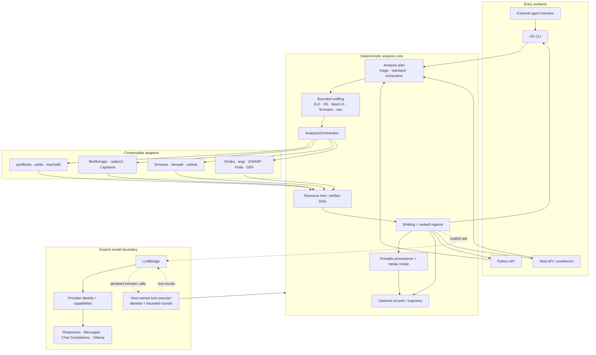
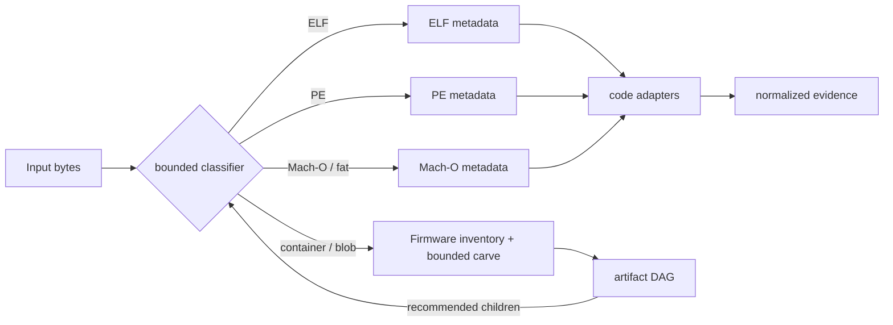

# Architecture

r2brief keeps evidence collection deterministic and treats model reasoning as
an optional consumer. The same analysis engine backs the CLI, Python API, web
workbench, and external harness contract.

## Contracts

| Boundary | Contract | Important behavior |
|---|---|---|
| CLI | stable verbs plus JSON schemas | JSON is stdout-only; diagnostics go to stderr |
| Python | `AnalysisOptions`, `AnalysisReport`, `analyze`, `brief`, `verify`, `ask` | analysis has no implicit persistence or model call |
| Adapter | availability, quick scan, deep scan | missing prerequisites become `AdapterUnavailable` / issues |
| Briefing | `r2b.briefing.v1` | ranked evidence and small snippets, not a tutorial |
| Handoff | `r2b.handoff.v1` | exact next argv for verify/decompile/follow-on triage |
| Provenance | `r2b.provenance.v1` | input hash, ordered adapter actions, evidence pointers, and replay recipes |
| LLM | normalized `LLMResponse` | provider, model, transport, usage, latency, tool calls |
| Tool loop | executor + allowlist + max rounds | declaration alone never authorizes execution |

Library callers can cache an `EnvironmentReport` and pass it to repeated
`analyze` calls. CLI persistence is explicit: `--no-save` avoids database,
record, chat-session, and trajectory writes.

Portable provenance is built even with `--no-save`: it is embedded in the
in-memory result and public payload rather than read back from SQLite. Region
`evidence_refs` point to the adapter payload and its digest. See
[Provenance and replay](PROVENANCE.md).

## Format and adapter dispatch

Format parsing uses bounded built-in checks first and optional format libraries
for richer metadata. ELF-only adapters are gated after classification; PE and
Mach-O subjects still receive compatible radare2/Capstone work rather than
being rejected as non-ELF.

## Graph semantics

The artifact DAG and evidence map answer different questions:

- The artifact DAG is byte/container topology: subject, partitions,
  filesystems, files, extracted code, hashes, offsets, and `contains` /
  `extracted_from` relationships. Portable records may also retain compact
  import and string nodes, but the workbench overlays only the structural DAG
  nodes so native adapter evidence is not shown twice.
- The evidence map joins that topology to static code, strings, imports, tool
  status, runtime observations, and investigation actions. Overview mode draws
  no synthetic route; linked and dense views show only recorded edges.

An import or string is a pivot, not behavior. A static behavior candidate needs
a caller/xref and relevant data flow. Observed behavior needs runtime evidence
with an establishing tool/run. Model interpretations are marked proposed and
remain separate from deterministic evidence. The graph does not infer
maliciousness, exploitability, or a vulnerability category.

For a corpus, the scalable primary view should remain a file/artifact tree or
table. The graph is for the selected subject, artifact, or claim—not an attempt
to render every node in a firmware estate at once.

## Model integration

Provider identity is separate from wire protocol:

| Provider | Default transport | Endpoint behavior |
|---|---|---|
| OpenAI | Responses | SDK default unless `base_url` is explicit |
| Anthropic | Messages | native Anthropic endpoint |
| xAI | Responses | explicit xAI endpoint |
| Kimi / Moonshot | Chat Completions | explicit Moonshot endpoint |
| GLM / Z.ai | Chat Completions | endpoint inferred from the selected key family or set explicitly |
| Ollama | native Ollama | local URL, no hosted credential |
| exo | Responses | local cluster URL, no hosted credential |
| OpenRouter / vLLM / llama.cpp | declared per provider | explicit provider or local URL |

`LLMBridge.generate` can return tool calls to an embedding host. It executes
nothing unless the host supplies both an executor and an allowlist; execution
is capped at 0–8 rounds. A fallback provider is not attempted after a tool has
executed, preventing cross-provider replay of side effects.

## Do we need MCP?

Not in the core. A subprocess already gives agent harnesses discoverable verbs,
stable JSON, isolated stderr, and exact next argv; the Python API gives in-process
callers typed values and host-owned function tools.

An optional MCP adapter becomes useful when a host specifically needs dynamic
tool discovery, typed remote invocation, or a long-lived shared server. If
added, it should translate MCP calls into the public Python API and must not own
analysis logic, secrets, persistence policy, or a second tool executor.

Ghidra MCP is a particularly good deep-worker boundary once an artifact has
earned a stateful program database. It is not a cheap corpus-intake boundary.
The deployment split, promotion contract, and honest current-vs-reference
status are in [Deployment and binary feeds](DEPLOYMENT.md).

## Trust boundaries

- The default triage path reads the target but does not execute it.
- Dynamic adapters are explicit and should run in an isolation boundary suited
  to the target.
- Extraction is bounded by file count, byte count, depth, and timeout.
- Model providers receive a rendered briefing only after deterministic analysis.
- API keys are read from named environment variables; committed TOML stores only
  provider settings and the environment-variable name.
- The web server binds locally by default, disables debug by default, restricts
  development CORS origins, and caps uploads.

## Extension points

- Analyzer: implement `AnalyzerAdapter` and register it with the orchestrator.
- Format: add a parser/classifier result and explicit adapter-compatibility gate.
- Provider: add a `ProviderSpec`, client transport, and response normalization.
- Surface: consume `AnalysisReport` or the versioned briefing/handoff schemas.
- Flavor: add `config/flavors/<name>.toml` and setup selection policy.
