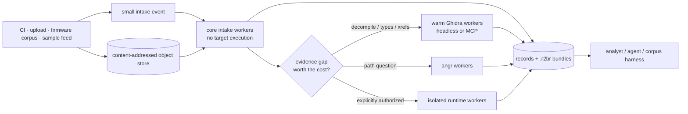

# Deployment and binary feeds

r2b is deployable today as a CLI, Python library, or local web service. It does
not yet ship a queue consumer, managed object-store adapter, or multi-tenant
control plane. Those boundaries are deliberate: a feed system should transport
content references and work requests, while r2b owns analysis and portable
evidence.

## The useful split



The intake event should not contain the binary. A queue message can stay close
to this shape:

```json
{
  "schema_version": "r2b.intake.v1",
  "artifact_uri": "s3://quarantine/sha256/5a…",
  "sha256": "5a…",
  "size": 184320,
  "profile": "triage",
  "requested_evidence": ["identity", "topology", "code_map"],
  "limits": {"seconds": 60, "bytes": 268435456},
  "labels": {"feed": "firmware-ci", "tenant": "lab-a"}
}
```

The worker fetches to scratch space, checks the byte count and SHA-256, invokes
the public Python API or `r2b brief --json`, writes a target-free `.r2br`, then
acknowledges the event. A natural idempotency key is the hash of the subject,
analysis plan, r2b version, and analyzer fingerprint. Delivery can therefore be
at least once without treating a retry as a new finding.

Object storage can be S3, R2, MinIO, GCS, Azure Blob, or a mounted local CAS.
The queue can likewise be supplied by the host. r2b does not need SDK
dependencies for every cloud in its core wheel.

## Capability-sized workers

Do not build one image containing every reverse-engineering tool.

| Worker | Default authority | Typical capabilities |
|---|---|---|
| `core` | read bytes; no target execution | built-in format parsing, firmware signatures, libmagic, radare2 |
| `extract` | bounded unpack to scratch | binwalk3 or unblob, recursion/byte/file/time limits |
| `static-depth` | selected artifacts/functions | Ghidra, DWARF, angr, Capstone spot checks |
| `runtime` | separate queue and explicit approval | Frida, GEF, external QEMU/VM harness |

Workers should advertise capabilities, architectures, versions, and isolation
policy. The dispatcher asks for evidence—identity, topology, a caller, data
flow, decompilation, or a runtime observation—not a brand-name tool. It stops
when the requested evidence exists, remaining producers are redundant or
unavailable, or the time/byte budget is exhausted.

This is the integration seam that prevents “supported tools” from becoming a
logo wall. Tool names remain in provenance so an analyst can audit how a claim
was established.

## Ghidra MCP: the steelman

A Ghidra MCP server is the stronger abstraction once a program is loaded and
the job is iterative reverse engineering: navigate xrefs, decompile another
function, inspect P-code, apply types, rename symbols, comment, and retain
project state. r2b should not recreate hundreds of program-database operations
or pretend its evidence map replaces Ghidra.

r2b covers a different boundary: inexpensive intake across a pile of unknown
objects, bounded dispatch across formats, recorded skips and disagreements,
ranked pivots, exact follow-up commands, and a portable `.r2br` handoff. Its job
is to decide which artifacts and functions have earned a stateful Ghidra
session, then pass the evidence that motivated that promotion.

A promotion request should carry an artifact hash/reference, function address
or byte range, evidence IDs, the analyst's thesis, requested capability, and a
budget. It should not copy raw binaries or large decompiler output through MCP
messages.

The two systems therefore compose cleanly:

- r2b is the intake and evidence spine.
- Ghidra headless or a Ghidra MCP worker is a deep static-analysis producer.
- A thin optional r2b MCP facade may expose `brief`, `verify`, `decompile`,
  `review`, and bundle inspection to hosts that require MCP discovery.
- MCP is not required on every worker and must not become a second scheduler,
  evidence store, or authorization layer.

Current r2b includes headless Ghidra and `ghidra_bridge` paths. A Ghidra MCP
backend and the feed dispatcher shown above are reference architecture, not
shipped services in v0.1.

## Fleet safety defaults

- Quarantine untrusted bytes and deny network egress on intake workers.
- Never execute a target in the core or extraction tier.
- Firmware inventory is read-only. `--extract` is explicit, and external
  extractors fail closed unless bubblewrap can remove network access. The
  `allow_unsafe_fallback` override is for an already isolated host only.
- `/api/tools/execute` and `/api/ghidra/execute-script` are disabled by
  default. Enabling `[web].enable_script_execution` also requires an
  `Authorization: Bearer` value matching `R2B_WEB_EXECUTION_TOKEN`.
- Frida or GEF requests through `/api/analyze` require the same token and
  `[web].enable_native_execution=true`.
- The reference Compose ports bind to loopback and drop Linux capabilities.
  A public deployment still needs authentication, TLS, request limits, and a
  separate disposable execution worker; do not expose this Flask service
  directly to the internet.
- Put runtime analysis on a separate queue and isolation boundary.
- Verify hashes after download and before publishing results.
- Use short-lived object-store credentials or signed URLs; never embed secrets
  in an event or `.r2br`.
- Namespace records and object keys by tenant/feed, and enforce upload, depth,
  file-count, byte, and wall-clock limits at both dispatcher and worker.
- Preserve tool versions, plan, limits, skips, and evidence pointers so results
  can be reproduced or compared without trusting model prose.

For one host today, use the repo-local installer and CLI. For a service, the
included backend image is the starting point, but production feed deployments
should split the capability tiers above instead of granting one container every
tool and every authority.
