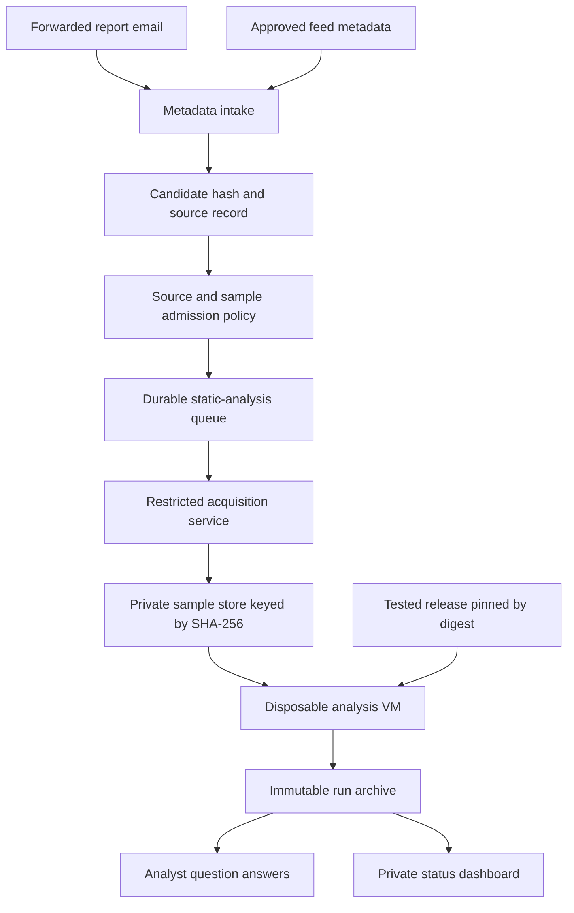

# Email and feed intake for sample analysis

Design proposal, not deployed infrastructure. The email receiver, queue,
release controller, run archive, and answer collector described here do not
exist yet. The questionnaire is ready in [SAMPLE-QUESTIONS.md](SAMPLE-QUESTIONS.md).

## Recommended first deployment

Use `reports@r2brief.com` for forwarded reports and sample references. If the
apex already has a mail provider, keep its MX records and use a forwarding rule
or a dedicated inbound subdomain instead. An existing website on Cloudflare
does not establish which provider handles domain email.

Cloudflare Email Routing can route a custom address to an Email Worker.
The Worker receives the message metadata and raw MIME stream. Store the
bounded original message privately, extract report URLs and candidate SHA-256
values, and enqueue a small metadata job. Preserve the surrounding text so a
hash of a document, archive, or legitimate tool is not mistaken for a malware
sample hash. Deduplicate receipts using a content digest as well as Message-ID.
Treat email authentication as one input to admission, not proof that a sample
is safe. Do not trust a sender-supplied Authentication-Results header.

Start with forwarded newsletters from your own authenticated mailbox and a
small set of expected publishers. Do not offer an unrestricted public binary
attachment inbox in v1. Keep live sample bytes in the separate lab store;
the public site's account needs only report metadata and private result links.

Sources: [Cloudflare email handler](https://developers.cloudflare.com/email-service/api/route-emails/email-handler/),
[routing setup](https://developers.cloudflare.com/email-service/get-started/route-emails/).
If existing mail infrastructure is easier, [Postmark inbound webhooks](https://postmarkapp.com/developer/user-guide/inbound)
are an alternative. They require a receiver that authenticates provider
delivery, handles retries idempotently, and validates payload limits.



An external lab service can use a [Cloudflare Queues pull consumer](https://developers.cloudflare.com/queues/configuration/pull-consumers/).
Keep queue credentials in the controller, outside the disposable analysis VM.
The Worker handles intake; native radare2, capa, DiE, and Ghidra run on lab
machines. Use leases, heartbeats, bounded retries, and a dead-letter queue.
Archive a completed attempt before acknowledging its queue message.

## Detecting new samples

Two sources can create the same candidate record:

1. An email mentions a sample hash and report.
2. A scheduled metadata poller sees a new hash from an approved provider.

Provider-specific metadata APIs are preferable to scraping arbitrary links.
For example, [MalwareBazaar's API](https://bazaar.abuse.ch/api/) documents
recent-sample queries and authentication. A feed watermark should have overlap
and hash deduplication to tolerate delayed records. Keep provider limits and
credentials outside analysis jobs. Receiving a hash does not require immediately
downloading the sample.

Admit candidates by configured source, exact expected hash, permitted format,
size, availability, and daily budget. New or ambiguous sources stay pending for
analyst selection. Preapproved sources and profiles can be queued automatically
without asking about each item. Source-report labels remain attributed claims.

Acquisition is a separate restricted service. It fetches from fixed provider
endpoints or approved publisher hosts, checks every redirect and resolved
destination, caps download bytes/time, and verifies the expected SHA-256.
Do not fetch arbitrary email URLs or use email text as shell arguments.
Archive and extracted sample hashes must be tracked separately. Extraction
happens inside the disposable lab with explicit file/depth/byte limits.

The existing `scripts/corpus_intake.py` handles pinned benchmark sources. It is
not an email or malware-feed downloader and should keep its current scope.

## What “latest r2brief” should mean

Default to the newest successfully built and smoke-tested tagged release.
If you want main-branch testing, use a separate channel pinned to a successful
CI commit; label it experimental and retain its results separately.

A release controller resolves the channel to a full commit and immutable image
digest before a job is dispatched. Build the analysis image in a separate
trusted build environment, never in response to email instructions. Verify the
published artifact identity and retain the dependency lockfile and image digest.
Jobs cannot `git pull`, install packages, or change versions mid-run.

Pin analyzer versions and rule/signature databases too. Otherwise a changed
capa or DiE database can masquerade as an r2b improvement. The current adapters
preserve native reports but do not provide a complete immutable inventory of
all installed rules; the image build must supply that inventory.

Use two identities:

- Sample identity: SHA-256 of the actual analyzed bytes.
- Run specification: sample SHA-256 + image digest + configuration digest +
  question-set digest. Each retry has a separate attempt ID.

Repeated email references attach to the same sample. An already completed run
specification does not run again merely because another email arrived. A new
release creates a new specification. Initially re-run a fixed small mixed
control set per release; do not automatically reprocess the entire archive.

## Static analysis worker

Use a disposable VM on a dedicated lab host with no network egress, host
credentials, shared clipboard, or general host filesystem mounts. A narrow
staged sample is read-only; outputs go to per-attempt storage with resource
limits. Extraction's bubblewrap layer is useful but is not the entire isolation
boundary. No sample-native execution, GEF, Frida, model calls, or open-ended
agent loop runs in this initial automatic profile.

Start with a fixed quick profile. An eligible deep static profile can be a
separate admitted job. It may enable capa/Ghidra on supported inputs, with
timeouts; an unsupported architecture is a coverage gap, not a clean result.
The questions are answered from collected evidence by an analyst or later
explicit review. They do not become autonomous tool instructions.

For a manually exercised CLI worker, these are existing commands:

```bash
r2b env --config /job/run.toml --json
r2b brief /input/sample.bin --config /job/run.toml --quick --json
```

Use a private run-specific configuration with trajectory recording and storage
enabled, native execution disabled, and all output paths inside the job. Do not
use `--no-save`: it disables records and trajectory persistence. CLI options
must be generated from the fixed profile and executed as argv arrays, never
constructed by evaluating a message or returned prose.

For a future worker that needs a bundle from the exact same pass, retain the
AnalysisResult and use the existing `create_bundle()` library function on its
public payload. `r2b bundle create BIN` performs another analysis; do not call
it after a brief and describe both as the same run. The public `analyze()` API
is deliberately non-persistent; a worker must explicitly provide the existing
orchestrator/DAO storage wiring if it uses that path.

## Recording trajectories and preserving runs

Existing components:

- `TrajectoryDAO`: SQLite `trajectories` and ordered `trajectory_actions`.
- `AnalysisOrchestrator`: adapter action recording when a DAO and enabled
  trajectory configuration are provided.
- Provenance: input hash, adapter payload references/digests, selected config,
  and replay recipe. This is not a complete execution trace of arbitrary agents.
- Records: a merged per-sample view. They overwrite some current files and are
  not the immutable run history.
- Bundles: a portable analysis snapshot; target bytes excluded by default.

Add an outer run manifest linking the receipt, candidate, sample, release,
profile, question set, trajectory IDs, and output hashes. Record intake and
acquisition events separately from adapter events. Export DAO actions to JSONL
with their sequence, timestamp, action, and decoded JSON payload; preserve the
per-run database after closing its connections. A worker crash still produces
an explicit failed attempt and any recoverable partial evidence.

Suggested archive (private, outside Git):

```text
samples/<sha256>/sample.bin
runs/<run-spec-id>/<attempt-id>/
  run.json                 source, identities, versions, timings, completion state
  receipt.json             reference to original private message/feed receipt
  source-claims.json       report claims, kept separate from derived answers
  environment.json         tool availability and build inventory
  analysis.json            full public analysis payload
  briefing.json            compact briefing from the same pass
  trajectory.jsonl         recorded adapter actions in sequence
  events.jsonl             controller and process events
  answers.json             Q01–Q24 answers; not fabricated for unanswered questions
  stdout.txt
  stderr.txt
  analysis.r2br            bundle from that saved analysis
  manifest.sha256          output integrity inventory
```

Track process exit code and tool coverage separately. r2b can exit successfully
with missing adapters; that does not mean all questions were answered. Keep
per-command stdout/stderr, duration, timeout/cancel reason, and output hashes.
If an external agent is later used, its host must record prompts, model/version,
tool requests/results, and termination reason in a separate linked trajectory.
Do not imply the adapter DAO already captures those events.

Validate and size-limit worker outputs before ingestion into the trusted
archive; treat returned JSON, Markdown, HTML, filenames, and strings as
untrusted data. Keep the archive access-controlled and exclude keys, personal
mail headers, and sample bytes from public pages. Results should initially be
viewed on a private dashboard; an outbound digest is a separate opt-in action.

## Suggested rollout and acceptance checks

1. Receive forwarded reports and save metadata-only candidates. Check duplicate
   delivery, false hash matches, oversized messages, and unavailable sources.
2. Run selected local benign controls through isolated jobs. Demonstrate that
   timeout, crash, missing tool, and unsupported format produce visible states.
3. Validate the installed DiE/capa/unblob stack on the intended worker image.
   Current development-host validation is incomplete: DiE/capa are absent and
   the unblob live smoke test timed out. Do not promote that host as ready.
4. Analyze a few selected documented samples using the same fixed static profile.
5. Enable automatic admission for the limited source policy and daily quota.
6. On a tested release, re-run the fixed control set and compare coverage,
   elapsed work, and evidence quality. A lower count alone is not an improvement.

Before deployment, choose the inbound DNS/mail provider, private storage
location, isolated lab host, source admission policy, and release channel.
The website itself should never become the native analysis worker.
