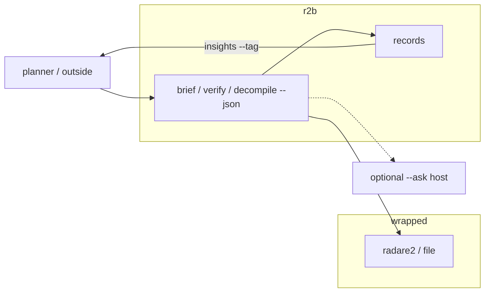

# Harness contract (omp and friends)

Type `r2b`. Schema ids stay `r2b.*` (library name). The planner
(omp, Claude Code, Grok, a script) shells out.
Do not absorb a planner here. Lib / harness / web and `--quick` vs deep:
[USAGE.md](USAGE.md).



## argv

Parse **stdout JSON**. Record/session chatter and `--ask` prose go to **stderr**.

| Command | Shape |
|---|---|
| `r2b env --json` | tools + keys |
| `r2b setup --json` | `r2b.setup.v1` flavor plan |
| `r2b brief BIN --quick --json` | `r2b.briefing.v1` + `handoff` (`r2b.handoff.v1`) |
| `r2b brief BIN --quick --json --ask` | same + `ask_result` (empty → exit 2) |
| `r2b brief BIN --quick --verify --json` | briefing + `verified_imports` |
| `r2b review BRIEF.json --mode rules --json` | `r2b.review.v1`, zero model calls |
| `r2b review BRIEF.json --mode both --thesis T --json` | base order + validated model order + rank differences |
| `r2b verify BIN --json` | `{binary, verdicts}` with `call_sites[].address` (call site) and `function_addr` (containing-function VA) |
| `r2b decompile BIN ADDR --json` | `{success, c, function_addr, ...}` — ADDR may be a call site |
| `r2b records list --json` | record index |
| `r2b insights --tag T --json` | collapsed SHA findings |

Stable flags: `--config`, `--quick`, `--json`, `--tag`, `--extract`,
`--ask`, `--ask-regions`, `--verify`.

Review adds `--mode` and `--thesis` without changing the briefing contract.

`--ask` is optional. A briefing without a model is still useful. Do not
turn `brief` into an LLM plan that then runs `analyze`.

`handoff` is the agent-facing slice: `next_argv` plus compact regions
(no ask templates). Prefer it over re-parsing `overall_ask`. ELF:
`verify` only for `system`/`popen`/`exec*`. Function VAs stay on
`handoff.regions[].addr`; do not auto-queue `decompile` (Ghidra is
optional, and decompiling rank-1 `main` is not a reliable next
command). Wrapper: `brief` a carved child or `--extract`. Never
`decompile 0x0` on the blob. `next_argv` may be empty (no process-launch
import, no carved child, or a broad runtime/monolith that needs scope
first). When `handoff.requires_scope=true`, choose one of
`scope_options`—dependency, crash address, export, subsystem, or
version diff—before executing a generic follow-up.

```bash
r2b brief BIN --quick --json | jq -r '.handoff.next_argv[]'
```

`--ask` is one LLM pass on that briefing, not a second analysis. Prose
still goes to stderr; structured answers are `ask_result` on stdout.

Overlays (OpenRouter / xAI / Ollama / Anthropic) are only for explicit model
work: `--ask`, Chat, or `review --mode llm|both`.
How to point lib / CLI / web: [USAGE.md](USAGE.md#pointing-at-a-model).
A planner with its own model needs `r2b env --json` then `brief --json`,
not a key in this process.

## exit codes

| rc | meaning |
|---|---|
| 0 | ok |
| 1 | missing file / Ghidra not ready |
| 2 | ask/review response was empty or invalid, or review input failed validation |

Missing adapters do not fail the process. `tool_status` / `env` say skipped.

## flavors

`core` (Pi / 8 GB), `lab` (workstation), `full` (16 GB+ x86_64). Add a
toml under `config/flavors/` and a branch in `r2b.environment.setup`.
Checkout: `uv sync`. Wheel: `r2b[std]` or skinny `r2b[r2]`.

## do / don't

- Do: `brief --quick` first. `verify` on `system`/`popen`/`exec*`. One
  `decompile ADDR`. Tag records. `insights --tag` to collapse duplicate SHA.
  Use `review --mode both` only when a thesis-specific second order is useful.
  Read `noise_assessment.focus_region_ids` for the deterministic evidence
  screen. `low_signal` means the current capsule lacks support; it is not a
  benign verdict. Model review remains ordering-only.
- Don't: whole-binary Ghidra dumps. `--extract` on a tiny ELF fixture. Teach.
  Invent symbols. Put keys in toml. Feed a briefing into a model to pick
  adapters inside this process.

## sample steps a planner can emit

```text
r2b brief /bin/ls --quick --json
r2b brief samples/bin/arm64/hello --quick --json
r2b brief samples/bin/arm64/vendor/busybox --quick --verify --tag linux --json
r2b verify samples/bin/arm64/vendor/busybox --import popen --json
r2b brief firmware.bin --quick --extract --json
r2b decompile ./httpd 0x12a40 --json
r2b insights --tag linux --json
```
