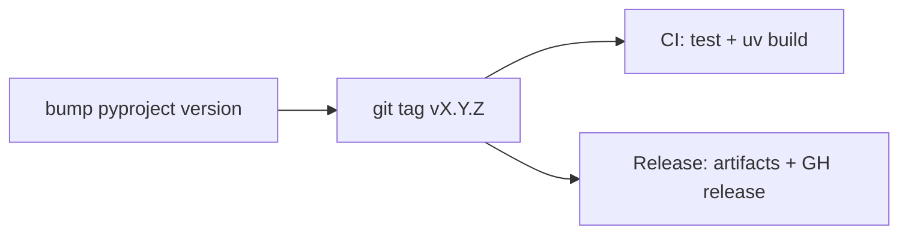

# Cutting a release

Version lives in `pyproject.toml` `[project].version`. The git tag is
`v` plus that number (`v0.1.0`).



## Steps

1. Update `CHANGELOG.md` (move Unreleased into `X.Y.Z`).
2. Set `version` in `pyproject.toml`. Keep `web/frontend/package.json` in sync if you care.
3. Commit on `main`.
4. Tag and push:

```bash
git tag v0.1.0
git push origin main
git push origin v0.1.0
```

5. GitHub Actions `Release` builds:
   - `r2b-X.Y.Z-py3-none-any.whl`
   - `r2b-X.Y.Z.tar.gz`
   - `r2b-frontend-vX.Y.Z.tar.gz`
   - `r2b-contracts-vX.Y.Z.tar.gz` (schemas + docs + LICENSE)
   - `install.sh`, `SHA256SUMS`
   - SLSA provenance attestation

Dry-run packaging without a tag: **Actions → Release → Run workflow**.

## Install a published build

```bash
uv pip install "r2b[r2] @ https://github.com/sandbornm/r2brief/releases/download/v0.1.0/r2b-0.1.0-py3-none-any.whl"
r2b --version
r2b brief /bin/ls --quick --json
```

The `ghidra` extra is PyPI `ghidra-bridge`, not a git URL. GitHub Releases are the package channel until a PyPI project exists. Default wheel is CLI-only; analysis/web/LLM SDKs are extras.

## Local package smoke

```bash
SKIP_FRONTEND=1 ./scripts/package_release.sh
uv pip install dist/r2b-*.whl
```
