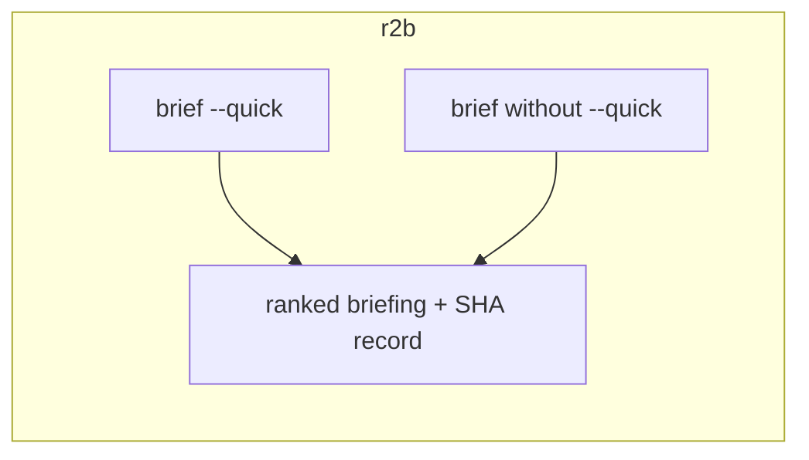
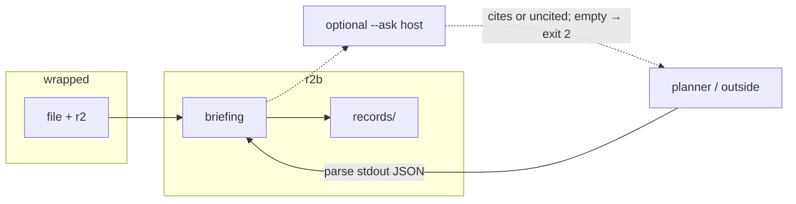

# Usage

`--quick` is the product. Depth and the web UI are opt-in. Analysis
never calls a model. The model, if any, reads a briefing.

Type `r2b`; import `r2b`. Schema ids (`r2b.briefing.v1`), wheel extras
(`r2b[r2]`), environment variables, and config paths use the same name.

## `--quick` vs not



| | `--quick` | omit `--quick` |
|---|---|---|
| Plan | `triage`, `deep=false` | `standard` |
| What you get | 4–6 places, ELF vs wrapper | function list, block CFGs, optional C |
| Runtime | host/tool/target dependent; measure locally | more; heavy tools remain explicit |
| Needs | `file` + radare2 | same, plus extras you turned on |

`--quick` still ranks import capsules / entry / strings, refuses to call a squashfs
`httpd`, writes a SHA-256 record, and can `--verify` first-arg at
`system` / `popen` / `exec*`. It is not `file` plus `r2 -qc ie`.

Without `--quick` you get listings: functions, CFG JSON the web map
eats, Ghidra one-function C if `enable_ghidra`, angr CFG if
`enable_angr`. That is depth on a region you already picked.

`--extract` stays `--quick`. binwalk3/unblob may add DAG children so the
next command is `brief ./httpd`.

## Where the LLM sits



- no `--ask` → no HTTP. Default for a harness.
- `--ask` → overall 6-bullet ask from the briefing.
- `--ask-regions N` → first N region asks.
- `review --mode rules` → copy the fixed region order; no HTTP.
- `review --mode llm|both` → request an independent order of known regions.
- `review --width N` → run `N` independent lenses and merge their cited evidence.

Overlays only configure that optional call. Claude Code / Codex / Grok
exec the CLI. They are not this process.

`--json` briefing always includes `handoff` (`r2b.handoff.v1`): ranked
regions with 12-line snippets and `next_argv` (`r2b verify` /
`decompile ADDR` / `records show`). That is the second-round input for
another agent. `--ask` is one optional LLM pass on the same briefing;
`ask_result` rides on the JSON. A planner with its own model skips
`--ask` and execs `handoff.next_argv`.

Do not feed a briefing into a model to pick the next adapter. That
duplicates omp / Claude Code plan mode and makes `brief --quick`
non-reproducible.

| Layer | Who decides | Same binary, same result? |
|---|---|---|
| Orchestrator | flavor + `--quick` / `--extract` | yes — ranked regions |
| `review --mode rules` | fixed point table already in the briefing | yes — copied, never rewritten |
| `review --mode llm|both` | model reorders known evidence IDs | no — saved separately as `r2b.review.v1` |
| `review --width N` | independent lenses over one saved briefing | rules mode is reproducible; model modes record each response |
| `--ask` / Chat | you, after the briefing exists | cites never rewrite the record |
| Planner (omp, Claude Code, Grok) | model picks `verify` / `decompile ADDR` | argv in, JSON out |

`POST /api/analyze` does not call a model. `autoAskLLM` defaults off.
Chat sends `call_llm` when you type. Hosted SDKs are extra `llm`. Flask
is extra `web`. Ollama `--ask` needs neither.

### Compare the fixed and model orders

`review` consumes a saved `r2b.briefing.v1`, public analysis JSON, or `.r2br`
bundle. It never edits the briefing, its point scores, or `handoff.next_argv`.

```bash
r2b brief ./httpd --quick --max-regions 12 --no-save --json > brief.json
r2b review brief.json --mode rules --json
r2b review brief.json --mode llm --thesis 'trace request data to process launch' --json
r2b review brief.json --mode both --thesis 'trace request data to process launch' --json
```

| Mode | Model call | Output |
|---|---:|---|
| `rules` | no | immutable base order copied from the briefing |
| `llm` | yes | base order plus a model-proposed order |
| `both` | yes | both orders plus computed rank differences |

`compare` is an alias for `both`. The model receives candidates in canonical
ID order without point scores, which reduces anchoring on the rule order. Its
response must be an exact permutation of the supplied region IDs. Every reason
must cite an evidence ID assigned to that region. Unknown, duplicate, or
missing region IDs and unknown evidence IDs fail closed.

This validation constrains references; it does not prove the model's prose.
Reasons remain proposals. `r2b.review.v1` records the briefing and candidate
hashes plus provider/transport metadata. Tool calls are disabled in this first
contract version (`tool_rounds=0`), so review cannot run a target, shell
command, verifier, or decompiler.

### Review the same evidence from several angles

Depth and width answer different questions. Analysis depth collects more
evidence. Review width asks more questions of the evidence already saved in a
briefing.

```bash
r2b review brief.json --mode rules --width 3 --top 2 --json
r2b review brief.json --mode both --width 3 --top 2 --json
r2b bundle create ./httpd -o httpd-width3.r2br \
  --review-width 3 --review-mode rules --review-top 2
```

The default lenses are triage, execution boundaries, input to effect, and
coverage gaps. Each pass receives the same canonical candidates and never sees
another pass's answer. `r2b.review-set.v1` records the individual orders, the
deduplicated evidence union, and the regions that first appeared at each
width. Agreement is counted by lens, so rules and model passes for one lens do
not become two votes.

Rules mode supports the built-in lenses and makes no model call. Custom
`--review-lens` values require `llm` or `both`; the configured provider remains
bound to known region and evidence IDs and cannot run tools. Width is useful
only when the briefing contains several meaningful candidates. If the union
stays flat, run a targeted verifier or decompile instead of adding another
lens. See the [recorded AArch64 example](case-studies/review-width-aarch64.md).

## Three hosts

**Library** — typed public surface. No Typer, Flask, persistence, or model call.

```python
from r2b import AnalysisOptions, analyze

report = analyze("httpd", options=AnalysisOptions(profile="triage"))
assert report.briefing["schema_version"] == "r2b.briefing.v1"
for argv in report.handoff["next_argv"]:
    print(argv)
```

**Harness** — [HARNESS.md](HARNESS.md). Planner owns the loop.

```bash
r2b env --json
r2b brief ./httpd --quick --verify --tag c7 --json
r2b verify ./httpd --import popen --json
r2b decompile ./httpd 0x12a40 --json
```

**Web UI** — `uv sync` includes the web dependencies in a checkout. The
`r2b[std]` wheel contains the built frontend; run `r2b-web`. Chat is the
session-oriented equivalent of the optional ask path.

## Pointing at a model

Two slots:

| Slot | Who | Needs a key in this process? |
|---|---|---|
| Planner | omp / Claude Code / Codex / Grok | no |
| `--ask` / Chat | this process | yes, unless Ollama |

`brief --quick` needs no LLM config. For `--ask`:

```bash
# local, default
ollama pull gemma3:4b
r2b brief /bin/ls --quick --ask

# hosted
cp config/openrouter.example.toml config/local.toml
echo 'OPENROUTER_API_KEY=sk-or-...' >> .env
r2b env --json
```

Toml names the env var, never the secret. `.env` is read automatically.
`R2B_CONFIG` is only needed if `local.toml` is not in the checkout.

Default `--ask` host is local Ollama. Copy an overlay for OpenAI,
Anthropic, xAI, Kimi, Z.ai/GLM, OpenRouter, exo, vLLM, or llama.cpp.
Each provider declares its transport and endpoint; custom/local endpoints use
`base_url`. Extra `llm` installs hosted SDKs; Ollama needs none. Leave
`enable_fallback` off unless cross-host fallback is intentional. Overlays:
[README](../README.md#models).

### Library

After `analyze`, opt in—or hand the briefing JSON to your own client.

```python
from r2b import review

response = report.ask("Which region should I verify first, and why?")
print(response.text)

fixed = review(report, mode="rules")
print([item["region_id"] for item in fixed["base_order"]])

wide = review(report, mode="rules", width=3, top_k=2)
print(wide["overlay"]["marginal"])
```

### CLI

```bash
r2b brief ./httpd --quick --verify --tag lab --json
r2b brief ./httpd --quick --json --ask
r2b brief ./httpd --quick --json --ask-regions 3
```

### Web

Same `local.toml` + `.env`. Restart `r2b-web` after swapping overlays.
`POST /api/analyze` does not call a model. Confirm with `r2b env --json`.

## Sample binaries

Use the shallow corpus for format/architecture sanity checks. It compiles the
same source for every toolchain available on the current host and prints skips
for unavailable cross-compilers.

| Binary | Why | What `--quick` should expose |
|---|---|---|
| `/bin/ls` | everyone has it, stripped | import capsules, then entry |
| `samples/bin/arm64/hello` | unstripped contrast | one region: Entry/main |
| `samples/bin/arm64/vendor/busybox` | sinks | process, network, runtime, and memory/path capsules |
| `samples/bin/arm64/vulnerable` | teaching `strcpy` | memory/path imports, credential strings, Entry/main |
| `samples/triage/bin/shallow-host` | native build of shared fixture | platform import spelling, entry, import capsules |
| Flipper ELF under `samples/firmware/` | wrapper vs ELF | `--extract` on a container, not on hello |

```bash
r2b env --json
./samples/triage/build.sh
r2b brief samples/triage/bin/shallow-host --quick --no-save --json
r2b brief /bin/ls --quick --json
r2b brief samples/bin/arm64/hello --quick --json
r2b brief samples/bin/arm64/vendor/busybox --quick --verify --tag linux --json
r2b verify samples/bin/arm64/vendor/busybox --import popen --import system --json
```

## Extras

Checkout `uv sync` installs tests plus r2 + web + hosted `--ask` SDKs.
angr/frida stay extras. CI: `uv sync --locked`.

| Extra | Pulls | When |
|---|---|---|
| *(none)* | Typer, Rich, sqlite, pyelftools | `r2b --version`, records |
| `r2` | r2pipe, Capstone, python-magic | `brief --quick` |
| `llm` | openai, anthropic SDKs | hosted `--ask` / Chat |
| `web` | Flask, flask-cors | `r2b-web` |
| `std` | r2 + web + llm | wheel that runs the product |
| `ghidra` | ghidra-bridge (PyPI) | GUI bridge |
| `symbolic` / `dynamic` / `analyzers` | angr, unicorn, frida | depth after you picked a region |

```bash
uv sync                         # checkout
uv sync --no-dev --extra r2     # skinny
uv pip install 'r2b[std]'      # wheel
uv pip install 'r2b[r2]'       # brief only
```

Flavor tomls ship in the wheel under `r2b/share/`.
