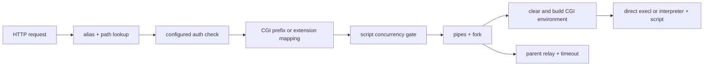

# OpenWrt uHTTPd on AArch64: following a request to `execl`

This investigation asks one narrow question: **what must an HTTP request cross
before this 66 KB server launches a CGI process?** The answer is useful even
without a vulnerability: it identifies the execution trust boundary, the
configuration that controls it, and the next deployment fact an analyst needs.

The AArch64 target was never executed. Quick triage, verification, and the
follow-up below are read-only static analysis.

## Pinned input and source

| Field | Value |
|---|---|
| Package | OpenWrt 24.10 `uhttpd` `2025.07.06~7e64e8ba-r5`, `aarch64_cortex-a53` |
| Package artifact | [Official OpenWrt download](https://downloads.openwrt.org/releases/24.10.4/packages/aarch64_cortex-a53/base/uhttpd_2025.07.06~7e64e8ba-r5_aarch64_cortex-a53.ipk) |
| Package metadata | [Official `Packages` index](https://downloads.openwrt.org/releases/24.10.4/packages/aarch64_cortex-a53/base/Packages) |
| Package size / SHA-256 | 32,604 bytes / `0a2d2858c81ec39c3d07048d9c79622602106b90d84a8534f112cd9ad883ab3f` |
| Exact source | OpenWrt uHTTPD [`7e64e8bad2415cec0a6d9770ec379db54273c7a7`](https://git.openwrt.org/project/uhttpd/tree/?id=7e64e8bad2415cec0a6d9770ec379db54273c7a7) |
| Revision provenance | `PKG_SOURCE_DATE=2025-07-06` and the full revision are pinned by the [OpenWrt 24.10 package recipe](https://git.openwrt.org/openwrt/openwrt/tree/package/network/services/uhttpd/Makefile?h=openwrt-24.10) |
| Program license | ISC, declared by the package recipe and present in the exact [source header](https://git.openwrt.org/project/uhttpd/tree/cgi.c?id=7e64e8bad2415cec0a6d9770ec379db54273c7a7) |
| Extracted target | `usr/sbin/uhttpd` |
| Target size / SHA-256 | 66,259 bytes / `2dea2e1017dd4839b375fff5a531b0d8c3317d8d031a3d44f0c2849cda1b0941` |
| Type | ELF64 AArch64 PIE, musl interpreter `/lib/ld-musl-aarch64.so.1`, stripped, no section header |

ISC permits redistribution with its notice, but a binary copy is unnecessary.
The [hash-checking fetch recipe](../../scripts/fetch_case_studies.sh) downloads
and extracts the publisher's package without invoking its contents. The 24.10
feed is rolling; if OpenWrt removes this exact package, the script fails instead
of silently substituting a new build.

## Quick triage: a useful lead, not a verdict

The exact recorded command was:

```sh
/usr/bin/time -p env R2B_IGNORE_LOCAL=1 \
  PYTHONPATH=/Users/michael/Github/r2brief/src \
  /Users/michael/Github/r2brief/.venv/bin/python -m r2b \
  brief /tmp/r2b-aarch64-cases/uhttpd-pkg/usr/sbin/uhttpd \
  --quick --no-save --json
```

It completed in 0.94 s wall time (0.74 s user, 0.17 s system). r2b identified
the AArch64/musl PIE and placed a 117-import region first. The high-signal
cluster was `socket` / `bind` / `listen` / `accept`, `fork`, `execl`, and
`dlopen` / `dlsym`. The same region also contained common string APIs, which
are leads rather than evidence of unsafe dataflow.

The important handoff was concrete:

```text
r2b verify /tmp/r2b-aarch64-cases/uhttpd-pkg/usr/sbin/uhttpd --import execl --json
```

The raw quick result is preserved as [JSON](results/uhttpd-aarch64-quick.json)
with [stderr and timing](results/uhttpd-aarch64-quick.stderr.txt).

## Verification: an honest empty result

The handoff was run exactly as written:

```sh
/usr/bin/time -p env R2B_IGNORE_LOCAL=1 \
  PYTHONPATH=/Users/michael/Github/r2brief/src \
  /Users/michael/Github/r2brief/.venv/bin/python -m r2b \
  verify /tmp/r2b-aarch64-cases/uhttpd-pkg/usr/sbin/uhttpd \
  --import execl --json
```

It returned `{"verdicts": []}` in 0.98 s. That does **not** mean there are no
callers. In this stripped, sectionless PIE, radare2 exposes a data reference to
the `execl` GOT relocation rather than a direct call xref. The current verifier
filters for call/indirect-code xrefs and recognizes `jal`, `jalr`, `call`, and
`callq`, but not AArch64 `blr`. This is a real verifier coverage gap.

The unedited result and timing are preserved in
[verify JSON](results/uhttpd-aarch64-verify-execl.json) and
[verify stderr](results/uhttpd-aarch64-verify-execl.stderr.txt).

## Bounded static recovery

A bounded radare2 follow-up recovered the missing edge without executing the
target. `axt @ 0x1fb60`, the GOT slot radare2 labels `reloc.execl`, identifies a
load at `0x936c` inside `fcn.000092e4`. The instruction windows then form this
chain:

| Binary evidence | Exact source at the pinned revision | What it establishes |
|---|---|---|
| `fcn.000091dc` checks the file mode and passes `0x92e4` as a callback to `fcn.0000a10c` | [`cgi_handle_request`, `cgi.c:67-89`](https://git.openwrt.org/project/uhttpd/tree/cgi.c?id=7e64e8bad2415cec0a6d9770ec379db54273c7a7) | A direct CGI must be a regular file with the other-execute bit; an interpreter-mapped file takes the other branch. |
| `fcn.0000a10c` makes two pipes, calls `fork`, redirects fd 0/1, and invokes the callback at `0xa23c` | [`uh_create_process`, `proc.c:330-398`](https://git.openwrt.org/project/uhttpd/tree/proc.c?id=7e64e8bad2415cec0a6d9770ec379db54273c7a7) | The single-threaded server delegates the script to a child and relays its request/response through pipes with a timeout. |
| `fcn.000092e4` clears the environment, repopulates it, changes to the document root, loads `reloc.execl`, and calls through `blr x4` | [`cgi_main`, `cgi.c:40-65`](https://git.openwrt.org/project/uhttpd/tree/cgi.c?id=7e64e8bad2415cec0a6d9770ec379db54273c7a7) | There are two launch forms: an interpreter plus the physical script path, or the physical CGI path directly. Neither form invokes a shell. |
| `fcn.00007c80` reads a configuration flag, calls `realpath` only when it is set, then performs the document-root prefix check | [`canonpath`, `file.c:80-130` and `uh_path_lookup`, `file.c:135-225`](https://git.openwrt.org/project/uhttpd/tree/file.c?id=7e64e8bad2415cec0a6d9770ec379db54273c7a7) | Canonical symlink resolution is controlled by `no_symlinks`; otherwise path normalization is lexical before `stat` and the prefix check. |

The exact source fills in the request semantics. `uh_get_process_vars` maps the
query, request URI, method, authenticated user, selected headers, and path data
into CGI environment variables ([`proc.c:130-180`](https://git.openwrt.org/project/uhttpd/tree/proc.c?id=7e64e8bad2415cec0a6d9770ec379db54273c7a7)). It does not append the query
string to an `execl` command line. `check_cgi_path` selects either an
extension-to-interpreter mapping or the configured CGI document-root prefix
([`cgi.c:94-124`](https://git.openwrt.org/project/uhttpd/tree/cgi.c?id=7e64e8bad2415cec0a6d9770ec379db54273c7a7)). Authentication is checked before
the chosen dispatch handler runs ([`file.c:838-888`](https://git.openwrt.org/project/uhttpd/tree/file.c?id=7e64e8bad2415cec0a6d9770ec379db54273c7a7)).



The bounded raw radare2 transcript, including all addresses above, is preserved
in [static follow-up output](results/uhttpd-aarch64-static-followup.txt).

## Configuration authority: source is only the first layer

The evidence has three configuration layers, and confusing them would turn a
useful static finding into an overclaim:

1. **Program defaults.** The pinned source defaults to CGI prefix `/cgi-bin`,
   three concurrent script requests, and a 60-second timeout
   ([`main.c:184-199`](https://git.openwrt.org/project/uhttpd/tree/main.c?id=7e64e8bad2415cec0a6d9770ec379db54273c7a7)).
2. **Package policy.** The package's unedited `etc/config/uhttpd` (SHA-256
   `4bb87a8ccfa98d9c7be831b4bb4f2895c4f188802a185bc5126d78ebdc3c7532`)
   sets document root `/www` and CGI prefix `/cgi-bin`. Its `.php` / `.cgi`
   interpreter examples and `no_symlinks` example are commented out. The
   package init script (SHA-256
   `f87e3c58bf1eb78a6eb52643ef974ba6f2eddbfa103b5acb333bb77d53c534b9`)
   maps UCI `cgi_prefix`, `interpreter`, `script_timeout`, and `no_symlinks`
   into `-x`, `-i`, `-t`, and `-S` process arguments. The release-branch
   [config template](https://git.openwrt.org/openwrt/openwrt/tree/package/network/services/uhttpd/files/uhttpd.config?h=openwrt-24.10)
   and [init script](https://git.openwrt.org/openwrt/openwrt/tree/package/network/services/uhttpd/files/uhttpd.init?h=openwrt-24.10)
   are readable counterparts; the hash-pinned `.ipk` is the authority for the
   files analyzed here.
3. **Deployment state.** A firmware image, writable overlay, upgrade package,
   or administrator can replace those defaults. Only the deployed UCI data,
   generated argv, and filesystem establish the actual execution policy.

## What this investigation taught

r2b's quick pass reduced an unfamiliar network daemon to the right boundary in
under a second: process launch. Following that lead reveals the program's
architecture—not just an import list. Requests are resolved and authenticated,
script work is concurrency-limited, CGI runs in a forked child with an explicit
environment, and the parent relays output under a timeout.

The handoff also exposed a useful negative result: automated `verify` currently
misses this AArch64 GOT-indirect `blr`, while a short relocation-centered static
walk recovers it. That distinction is more valuable than presenting an empty
verdict as success.

## The exact next question

**On the deployed image, is `no_symlinks` enabled, and which principals or
update paths can create or replace files or symlinks beneath `/www/cgi-bin` or
any extension-mapped script path?**

That question joins code evidence to the deployment's real execution trust
boundary. Answer it with the firmware filesystem, ownership/mode inventory,
UCI overlay, and upgrade/install scripts—not by inferring exploitability from
the `execl` import.

## What remains unproved

- No target code was executed and no request was sent.
- No deployed configuration, filesystem ownership, writable path, or active
  interpreter mapping was observed.
- Nothing here proves an unauthenticated caller can select or modify an
  executable target, bypass path/auth checks, or escape the document root.
- Query strings and selected headers become CGI environment variables; this
  case does not show them becoming a shell command.
- `high` in the quick result is triage priority, not a vulnerability rating.
- r2b reported `stripped=false`, while `file` and radare2 reported a missing
  section table / stripped binary. Treat stripping state as a tool disagreement
  in this result.
