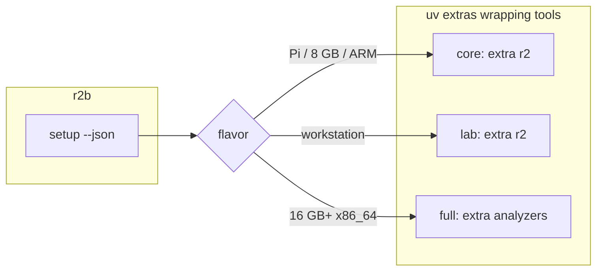

# Install

The command, import package, and wheel project are all `r2b`.



## One shot (from a clone)

```bash
git clone https://github.com/sandbornm/r2brief.git
cd r2brief
./scripts/install.sh
```

User-space: uv plus the extra `setup` picked (`r2` on a Pi). No sudo, no
`~/.config`, no overlay. If `radare2` is already on PATH, `brief --quick`
works when the script exits.

Published builds: GitHub Releases (see [RELEASE.md](RELEASE.md)).

```bash
uv pip install "r2b[r2] @ https://github.com/sandbornm/r2brief/releases/download/v0.1.0/r2b-0.1.0-py3-none-any.whl"
```

Override: `R2B_FLAVOR=lab ./scripts/install.sh`
Write a flavor toml only if you ask: `uv run r2b setup --apply --write-overlay`

## Contributor checkout

```bash
./scripts/setup.sh
```

This uses the same repo-local `.venv` but includes test/lint dependencies,
installs frontend dependencies, and builds the frontend. `scripts/install.sh`
keeps the smaller end-user environment. Neither command changes system Python.

## Config

`brief --quick` needs none. For `--ask`, either run Ollama (default) or
copy one overlay and put the key in `.env`:

```bash
cp config/openai.example.toml config/local.toml
echo 'OPENAI_API_KEY=sk-...' >> .env
uv run r2b env --json
uv run r2b brief /bin/ls --quick --verify --json
```

The installer also proves the package import, entry point, environment report,
and a no-save briefing. For the short command used throughout the docs:

```bash
source .venv/bin/activate
r2b brief /bin/ls --quick --json
```

Without activation, use `uv run --no-sync r2b ...` from the checkout.

No `R2B_CONFIG` in a checkout. Local exo / vLLM: skip the key, set
`base_url` in `config/local.toml`. Overlay list:
[README](../README.md#optional-model-hosts).

## Manual

```bash
curl -LsSf https://astral.sh/uv/install.sh | sh
sudo apt-get install -y radare2 file libmagic-dev   # brew: radare2 libmagic
uv sync
uv run r2b setup --json
```

Skinny: `uv sync --no-dev --extra r2`. Wheel: `'r2b[std]'` (brief + web
+ hosted `--ask`) or `'r2b[r2]'` (brief only). Ollama does not need
extra `llm`. Ghidra, angr, binwalk3: only if `r2b setup` did not put
them under `skip`.
